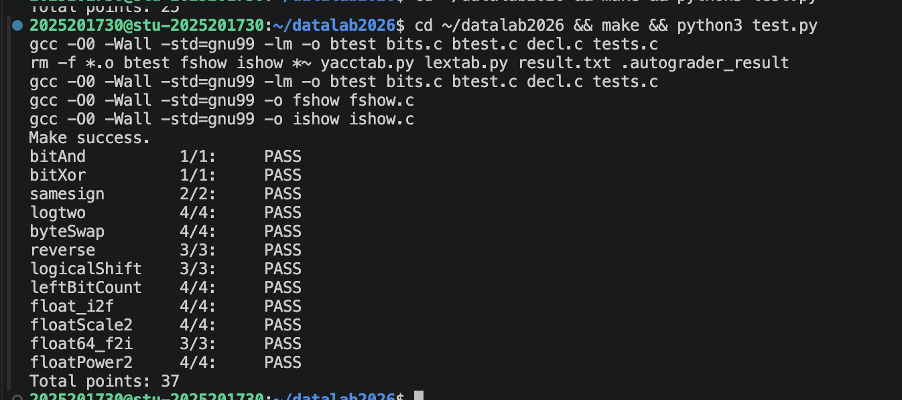

# DataLab 实验报告

姓名：时艺桐

学号：2025201730

## 测试结果

本实验在课程提供的 `ics-lab` 环境中使用 `python3 test.py -V` 进行测试，所有函数均通过正确性与合规性检查，总分为 37/37。

| 函数 | 得分 | 函数 | 得分 |
| --- | ---: | --- | ---: |
| bitAnd | 1/1 | bitXor | 1/1 |
| samesign | 2/2 | logtwo | 4/4 |
| byteSwap | 4/4 | reverse | 3/3 |
| logicalShift | 3/3 | leftBitCount | 4/4 |
| float_i2f | 4/4 | floatScale2 | 4/4 |
| float64_f2i | 3/3 | floatPower2 | 4/4 |
| **总分** | **37/37** |  |  |

测试截图：

## 解题报告

### 亮点

1. `float_i2f`：从整数的符号和最高有效位出发，手动拼出 IEEE 754 编码，并处理了舍入。
2. `logtwo`：把原本逐位查找的想法改成 16、8、4、2、1 的分段查找。
3. `leftBitCount`：区分“右移检测”和“左移推进”，逐步统计开头连续的 1。

### bitAnd

**核心思路：** 使用德摩根律，把 `x & y` 改写为 `~(~x | ~y)`。

### bitXor

**核心思路：** 两个数异或为 1，等价于它们既不能同时为 1，也不能同时为 0。

**调试记录：** 我最初把异或拆成两种相反取值的情况，逻辑上没有问题，但用了 8 个运算符。后来分别排除 `x & y` 和 `~x & ~y`，运算符数量正好压到 7 个。

### samesign

**核心思路：** 两个输入都非零时，分别右移 31 位取得符号扩展结果，再用异或判断符号是否一致。

**边界处理：** 题目规定 0 既不是正数也不是负数，但 `samesign(0, 0)` 又要返回 1。因此我先处理两个数都为 0 的情况，再排除只有一个数为 0 的情况。

### logtwo

**核心思路：** 正整数最高位的 `1` 在第几位，向下取整的二进制对数就是多少。我最开始想不断右移 `v`，直到只剩下 1，但题目不允许循环和加法。

**实际写法：** 将最高位可能出现的范围按 16、8、4、2、1 分段检查。比较结果先是 0 或 1，再通过左移变成 0/16、0/8 等移动量，用它右移 `v`，逐步缩小范围。

**容易出错的地方：** 分段阈值必须与当前检查宽度对应，依次使用 `0xffff`、`0xff`、`0xf`、`0x3` 和 `0x1`。每轮移动量还要记入答案，否则右移后会丢失原来的位置信息。16、8、4、2、1 在二进制中互不重叠，因此可以用 `|` 代替 `+`。

### byteSwap

**核心思路：** 将 `n`、`m` 左移 3 位，换算成位偏移；用 `0xff` 提取两个字节，清空原位置后交换写回。

**调试记录：** 第一次写时我只列出了计算表达式，却忘记返回结果，测试始终得到占位值 2；补上 `return` 后才真正完成交换。

### reverse

**核心思路：** 把首尾位两两配对，每轮取出第 `i` 位和第 `31-i` 位，再移动到对方的位置。

**关键点：** 32 位中只有 16 对对称位置，因此循环 16 次即可。继续处理后半部分会重复计算同一对位置。

### logicalShift

**核心思路：** 先对 `int` 正常右移，再用掩码清除负数算术右移时补进来的高位 1。

**边界处理：** `n=0` 时不能为了构造掩码而移动 32 位，否则会产生未定义行为。因此我从最高位掩码出发，根据 `n` 调整需要清零的范围。

### leftBitCount

**核心思路：** 先对 `x` 取反，把“高位全是 1”变成“高位全是 0”，再依次检查高 16、8、4、2 位是否全为 0。

**实际写法：** 如果某一块满足条件，就把块大小加入结果，并将 `x` 左移相同的位数，让未检查的部分来到最高位。最后一两位再单独处理。

**边界处理：** 按 16、8、4、2、1 分块累计时，常规结果最多先得到 31，但 `x=-1` 的正确答案是 32。最后一位不能继续简单地用按位或累计，因为 `31 | 1` 仍然是 31，因此末尾需要根据剩余高位再执行一次加法。这里主要检查了全 0、最高位为 0、只有最高位为 1 和全 1 等边界输入。

### float_i2f

**核心思路：** 函数用 `unsigned` 装载转换后浮点数的 32 位编码。先保存符号位，再用无符号数保存绝对值，这样也能容纳 `INT_MIN` 的大小。随后找到最高有效位 `k`，用它计算阶码并决定尾数的移动方向。

**实际写法：** 有效位不超过 24 位时直接对齐；超过 24 位时保留高 24 位，并保存被丢弃的低位。丢弃部分超过一半时进位，正好一半时只有保留结果为奇数才进位。如果舍入产生新的最高位，还要把阶码加 1。最后拼接符号位、阶码和尾数。

**调试记录：** 第一版只保留了高 24 位，直接丢弃其余低位。我当时没有看出这道题还要求模拟整数转换为单精度浮点数时的舍入规则，整个漏掉了“就近舍入、正好一半时取偶数”这一步。后来补上被丢弃部分与中间值的比较：超过一半时进位，正好一半时根据保留结果的最低位决定是否进位。另外，进位可能把 24 位有效数字变成 25 位，此时还要同步增加阶码。

### floatScale2

**核心思路：** 先用掩码拆出符号位、阶码和尾数。阶码为 0 时左移尾数；普通规格化数给阶码增加一个单位。

**边界处理：** 我一度把阶码 254 和 255 混在一起。255 表示输入已经是无穷大或 NaN，需要原样返回；254 仍是普通规格化数，但乘 2 后会溢出为保留原符号的无穷大。

### float64_f2i

**核心思路：** 从 `uf2` 中取出符号位、11 位阶码和尾数的高 20 位，再将阶码减去 1023 得到真实指数。之后补回规格化数隐藏的最高位 1，并根据指数拼出整数部分。

**分支与边界：** 指数小于 0 时向零转换为 0；指数大于等于 31 时返回溢出值。指数超过 20 时，结果还会用到 `uf1` 中的位；不超过 20 时，只需从高 20 位尾数中截取。最后根据原符号决定是否取负。

**调试记录：** 我一开始沿用了单精度浮点数的偏置 127，但这一题处理的是双精度数，11 位阶码的偏置应为 1023。最初的边界判断也只围绕尾数移位展开，没有先把真实指数小于 0 的下溢情况和大于等于 31 的溢出情况分开。修正偏置并先处理这两个区间后，后面的位拼接才保持在有效移位范围内。

### floatPower2

**核心思路：** `x` 本身就是指数。规格化范围内，`2^x` 可以写成 `1.0×2^x`，因此符号位和尾数都为 0，只需把 `x+127` 放入阶码字段。

**范围划分：** `-126～127` 是规格化范围；`-149～-127` 使用非规格化编码，尾数里只有一个 1；小于 -149 返回 0；大于 127 返回正无穷。

**调试记录：** 初次划分区间时，几个端点的开闭容易写错。后来用 `-150、-149、-127、-126、127、128` 逐一检查：`-149` 仍可表示为最小非规格化数，`-126` 是最小规格化指数，`127` 仍是有限值，到 `128` 才返回正无穷。

## 反馈、收获与总结

这次实验最常卡住的不是 C 语法，而是怎样把题意翻译成位操作。做到后面，我开始习惯先画出要保留和清除的位，再决定掩码与移位方向。浮点题也让我真正理解了 `unsigned` 可以只作为位编码的载体。相比记住某个表达式，这种推导过程更方便我检查边界。

## 参考的重要资料

1. 课程仓库中的 [README](../README.md)、[bits.c](../bits.c) 题目注释及测试工具。
